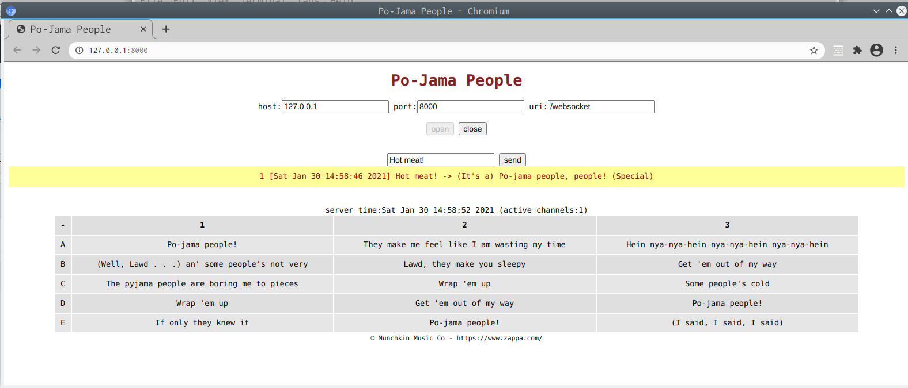

# Pyjamapeople

a simple but fully featured example of how to use **tornado**, **asyncio** and **websocket** together 
to build an application delegating the frontend UI to a browser, local or remote,
without the limits of the http dialog.

TAGS: tornado asyncio websocket 

1. create a virtualenv 
>     $ export VIRTENV_ROOT=desired-virtenv_root-path
>     $ mkdir ${VIRTENV_ROOT}
>     $ virtualenv -p /usr/bin/python3 ${VIRTENV_ROOT}

2. clone this project in ${PROJECT_ROOT}
>     $ git clone git@github.com:giovanni-angeli/pyjamapeople.git

3. build Install in edit mode:
>     $ . ${VIRTENV_ROOT}/bin/activate
>     $ cd ${PROJECT_ROOT}               
>     $ pip install -e ./

4. Run:
>     $ (. ${VIRTENV_ROOT}/bin/activate ; pyjamapeople &)
>     $ chromium http://127.0.0.1:8000/ &
>     $ firefox http://127.0.0.1:8000/ &

#

